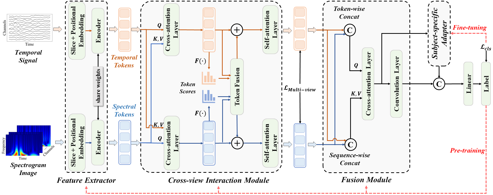

# TSformer-SA

The official implementation of **[A Temporal-Spectral Fusion Transformer with Subject-specific Adapter for Enhancing RSVP-BCI Decoding](https://arxiv.org/abs/2401.06340)**.




TSformer-SA is a symmetrical dual-stream Transformer comprising a feature extractor, a cross-view interaction module, a fusion module, and a subject-specific adapter. The inputs consist of EEG temporal signals representing the temporal view and the spectrogram images representing the spectral view. The feature extractor tokenizes the inputs and extracts the view-specific features. Subsequently, the cross-view interaction module extracts the common features from both views and the fusion module fuses the two-view features for classification. The above three modules are trained during the pre-training stage and only the subject-specific adapter is trained in the fine-tuning stage.


## 1&nbsp; Installation

Follow the steps below to prepare the virtual environment.

Create and activate the environment:
```shell
conda create -n tsformer python=3.9
conda activate tsformer
```

Install dependencies:
```shell
pip install -r requirements.txt
```


## 2&nbsp; Experiment

### 2.1&nbsp; Data Acquisition

The data acquisition and preprocessing procedures are consistent for all three tasks. EEG data are recorded using the SynAmp2 system (Neuroscan, Australia) with 64-channel Ag/AgCl electrodes placed according to the international 10/20 system, with a sampling rate of 1000 Hz. All the electrodes with an impedance of 10 kΩ or lower are referenced to the vertex and grounded on the AFz channel.

### 2.2&nbsp; Data Preprocessing

The collected EEG data are downsampled to 250 Hz. Subsequently, a linear phase 3-order Butterworth filter with a bandpass ranging from 0.5 to 15 Hz is applied to the signal to eliminate slow drift and high-frequency noise and prevent delay distortions. Next, the preprocessed data from each block are segmented into EEG trials. Each trial consists of 1-second EEG data starting from the stimulation onset to 1000 milliseconds (0 s to 1 s) after the stimulation onset. For each trial, data are normalized to zero mean and variance one. The subsequent analysis and classification of EEG signals rely on these segmented EEG trials (samples).


## 3&nbsp; Train

The TSformer-SA is optimized using the two-stage training strategy. The data from existing subjects are first utilized to pretrain the TSformer in advance and the data from new test subject are used to only fine-tune the subjectspecific adapter in the fine-tuning stage.

### 3.1&nbsp; Pre-training

```bash
python -m torch.distributed.launch --master_port 29502 --nproc_per_node=2 /TSformer-SA/Pre_train.py
```
### 3.2&nbsp; Fine-tuning

```bash
python -m torch.distributed.launch --master_port 29502 --nproc_per_node=2 /TSformer-SA/Fine_tune.py
```


## 4&nbsp; Cite

If you find this code or our TSformer-SA paper helpful for your research, please cite our paper:

```bibtex
@article{li2024temporal,
  title={A Temporal-Spectral Fusion Transformer with Subject-specific Adapter for Enhancing RSVP-BCI Decoding},
  author={Li, Xujin and Wei, Wei and Qiu, Shuang and He, Huiguang},
  journal={arXiv preprint arXiv:2401.06340},
  year={2024}
}
```
